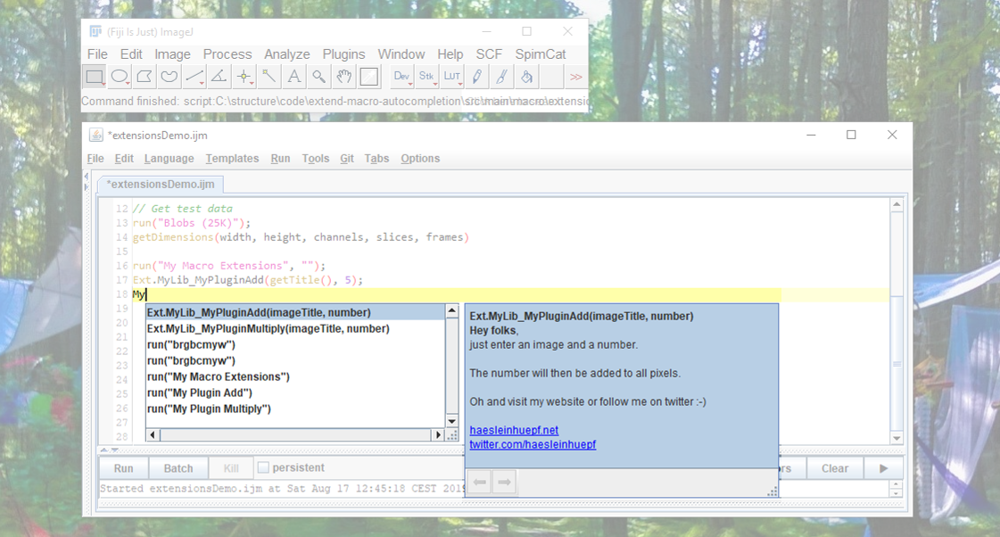

# Extending ImageJ Macro auto completion in Fijis script editor
## Outline
* [Introduction](https://haesleinhuepf.github.io/extend-macro-autocompletion/#introduction)
* [Starting point: a SciJava Fiji plugin](https://haesleinhuepf.github.io/extend-macro-autocompletion/#starting_point)
* [Extend ImageJ Macro](https://haesleinhuepf.github.io/extend-macro-autocompletion/#extend_macro)
* [Extend auto-completion of the script editor](https://haesleinhuepf.github.io/extend-macro-autocompletion/#extend_autocomplete)
* [What your plugin classes should contain](https://haesleinhuepf.github.io/extend-macro-autocompletion/#your_plugins)
* [Summary](https://haesleinhuepf.github.io/extend-macro-autocompletion/#summary)

<a name="introduction"></a>
## Introduction
Since we introduced auto-completion in Fijis script editor, some developers asked me 
how they can make their tools discoverable by auto-completion. 
That's a good question as the auto-completion also allows pointing users to online
resources or publications to cite.
This tutorial explains how to achieve this. I'm providing a [fully functional example](https://github.com/haesleinhuepf/extend-macro-autocompletion) as 
this might be a better starting point for developers.




<a name="starting_point"></a>
## Starting point: a SciJava Fiji plugin
As a starting point we assume to have a [maven](https://maven.apache.org/) project with a 
[pom.xml](https://github.com/haesleinhuepf/extend-macro-autocompletion/blob/master/pom.xml) file defining a [SciJava](https://scijava.org) plugin for [Fiji](https://fiji.sc).

Our project also contains a [class marked as Fiji plugin](https://github.com/haesleinhuepf/extend-macro-autocompletion/commit/5e10bab2e1e7b2389a7c2b528acf2473f798b7b8#diff-2187e4c3058b3cb68492cfc36ecf00ddR18-R19),
and [definition of all parameters](https://github.com/haesleinhuepf/extend-macro-autocompletion/commit/5e10bab2e1e7b2389a7c2b528acf2473f798b7b8#diff-2187e4c3058b3cb68492cfc36ecf00ddR74-R81) the SciJava way.
If you want to learn how to make SciJava/Fiji plugins, [this 5 minute video](https://www.youtube.com/watch?v=YIWpoBnnLio) is recommended.

The [actual algorithm](https://github.com/haesleinhuepf/extend-macro-autocompletion/commit/5e10bab2e1e7b2389a7c2b528acf2473f798b7b8#diff-2187e4c3058b3cb68492cfc36ecf00ddR26-R28) 
we want to ship to users is available as a single method simplifying incorporating it in ImageJ macro and the script editor.

<a name="extend_macro"></a>
## Extend ImageJ Macro
ImageJs [macro extensions](https://imagej.net/developer/macro/functions.html#Ext) are a pretty old and powerful mechanism to
extens ImageJs macro language with custom code. It can be used by defining a [class implementing the interface MacroExtensions](https://github.com/haesleinhuepf/extend-macro-autocompletion/commit/5e10bab2e1e7b2389a7c2b528acf2473f798b7b8#diff-eabc1fa5161dcb95bfc0de38d0ae8aa2R26) interface:

```java
public class MyMacroExtensions implements MacroExtension {
```

This class needs to implement two methods: At first, the [method](https://github.com/haesleinhuepf/extend-macro-autocompletion/commit/5e10bab2e1e7b2389a7c2b528acf2473f798b7b8#diff-eabc1fa5161dcb95bfc0de38d0ae8aa2R46) `getExtensionFunctions()` is called from the Macro Interpreter
in order to get a list of supported methods.
These methods will then be accepted by the macro interpreter in case the number and types of parameters are correct.
These parameters need to be defined in an int array an may contain entries according to [this definition](https://github.com/imagej/ImageJA/blob/master/src/main/java/ij/macro/MacroExtension.java). I only worked with these two so far:

* MacroExtension.ARG_STRING 
* MacroExtension.ARG_NUMBER

A valid ExtensionDescriptor could then look like this:
```java
new ExtensionDescriptor("methodName", new int[]{MacroExtension.ARG_STRING, MacroExtension.ARG_NUMBER}, this);
```

The `this` argument tells the Macro Interpreter which class can handle the particular macro extension.

As hardcoding this line for any method call is a bit odd, I suggest 
[an interface](https://github.com/haesleinhuepf/extend-macro-autocompletion/commit/5e10bab2e1e7b2389a7c2b528acf2473f798b7b8#diff-874e1a1ee04f7f4565da7ed3e9b44d6bR10-R15) 
all [your plugins](https://github.com/haesleinhuepf/extend-macro-autocompletion/commit/5e10bab2e1e7b2389a7c2b528acf2473f798b7b8#diff-2187e4c3058b3cb68492cfc36ecf00ddR19) 
need to implement:

```java
public interface MyMacroExtensionDescriptor {
    void runFromMacro(Object[] parameters);
    int[] parameterTypes();
    String description();
    String parameters();
}
```

The second responsibility of our MacroExtensions class is handling method calls. This is done by the `handleExtension(String name, Object[] args)` 
[method](https://github.com/haesleinhuepf/extend-macro-autocompletion/commit/5e10bab2e1e7b2389a7c2b528acf2473f798b7b8#diff-eabc1fa5161dcb95bfc0de38d0ae8aa2R28).
It has two parameters: The `name` of the method which was called and the arguments passed as array of Objects. 
Again, as it is odd to check the `name` variable for each individual method names, I suggest an alternative: 
the method 
[name shall be identical with the class name](https://github.com/haesleinhuepf/extend-macro-autocompletion/commit/5e10bab2e1e7b2389a7c2b528acf2473f798b7b8#diff-eabc1fa5161dcb95bfc0de38d0ae8aa2R33-R36) 
of your plugin prefixed with a custom library identifier preventing clashes with other macro extensions. 
This is no must but I believe it's a welcome simplification.
Furthermore, the object array usually comes with items of type `String` and `Double`. 
Knowing this allows us to cast and parse handed over parameters in our 
[individual plugin implementation](https://github.com/haesleinhuepf/extend-macro-autocompletion/commit/0da0983814c6128fc9f39e06cd667cecf015cd8c#diff-2187e4c3058b3cb68492cfc36ecf00ddR35-R44). 
Then, we can call our algorithm:

```java
@Override
public void runFromMacro(Object[] parameters) {
    // We get an array of objects from the Macro interpeter.
    // We need to convert/cast it to what we need
    ImagePlus imp = WindowManager.getImage((String)parameters[0]);
    double scalar = (Double)parameters[1];

    // call the actual algorithm
    actualAlgorithm(imp, scalar);
}
```

Implementing  `getExtensionFunctions()` and  `handleExtension(String name, Object[] args)`  is all you need to enable 
ImageJs Macro Interpreter to offer your methods to end-users coding macro. 
Last, but not least, you need to actually [tell](https://github.com/haesleinhuepf/extend-macro-autocompletion/commit/5e10bab2e1e7b2389a7c2b528acf2473f798b7b8#diff-eabc1fa5161dcb95bfc0de38d0ae8aa2R66) the Macro Interpreter that your extension exists:

```java
// Activate this class as handler for macro extensions
Functions.registerExtensions(this);
```

<a name="extend_autocomplete"></a>
## Extend auto-completion of the script editor
In order to tell users via auto-completion that your methods exist and which parameters they take, you need 
[a class](https://github.com/haesleinhuepf/extend-macro-autocompletion/commit/5e10bab2e1e7b2389a7c2b528acf2473f798b7b8#diff-beb52a1812018a879515d5dc34958bf2R22) 
implementing the
[MacroExtensionAutoCompletionPlugin](https://github.com/imagej/imagej-legacy/blob/1be9f2c352868b648f873954762024c6c43ff666/src/main/java/net/imagej/legacy/plugin/MacroExtensionAutoCompletionPlugin.java)
interface.
This interface allows you to ship entries of the auto-completion pulldown of type 
[BasicCompletion](https://github.com/bobbylight/AutoComplete/blob/master/AutoComplete/src/main/java/org/fife/ui/autocomplete/BasicCompletion.java)
to the 
[script editor](https://github.com/scijava/script-editor).

A valid `BasicCompletion` would look be

```java
new BasicCompletion(completionProvider, "MyLib_MyMethid", null, "This is the description.");
```

Again, as it's odd to define these entries by hand, we do this via the 
[interface](https://github.com/haesleinhuepf/extend-macro-autocompletion/commit/5e10bab2e1e7b2389a7c2b528acf2473f798b7b8#diff-874e1a1ee04f7f4565da7ed3e9b44d6bR10-R15)
introduced above.

Last but not least, in order to make all plugins discoverable, [put them in a list](https://github.com/haesleinhuepf/extend-macro-autocompletion/commit/5e10bab2e1e7b2389a7c2b528acf2473f798b7b8#diff-bbfe4af2e74a5649dddd2f7175700d61R22-R25). 

```java
 // list of all available plugins
MyMacroExtensionDescriptor[] list = {
        new MyPluginAdd(),
        new MyPluginMultiply()
};
```
There is an alternative for implementing an automated discovery strategy demonstrated in the 
[plugin zoo example code](https://github.com/mpicbg-scicomp/ij2course-scijava-plugin-mechanism/tree/solution/src/main/java/de/mpicbg/scf/rhaase/fiji/ij2course/scijavaservices).

<a name="your_plugins"></a>
## What your plugin classes should contain
In order to make your plugins discoverable by ImageJs Macro Interpreter and auto completion in Fijis script editor, 
feel free to fork this repository, put in your algorithms (or depend on them) 
and implement a small class for every method you would like to offer to the users. This class should contain:

* A list of parameters the algorithm takes. Readable for 
[ImageJ](https://github.com/haesleinhuepf/extend-macro-autocompletion/commit/5e10bab2e1e7b2389a7c2b528acf2473f798b7b8#diff-834e9703b61009f26a4f83ffe5c636e4R46-R53)
and readable for 
[humans](https://github.com/haesleinhuepf/extend-macro-autocompletion/commit/5e10bab2e1e7b2389a7c2b528acf2473f798b7b8#diff-834e9703b61009f26a4f83ffe5c636e4R55-R62):
```java
@Override
public int[] parameterTypes() {
    return new int[] {MacroExtension.ARG_STRING, MacroExtension.ARG_NUMBER};
}
```
```java
@Override
public String parameters() {
    return "imageTitle, number";
}
```

* A [description of the algorithm](https://github.com/haesleinhuepf/extend-macro-autocompletion/commit/5e10bab2e1e7b2389a7c2b528acf2473f798b7b8#diff-834e9703b61009f26a4f83ffe5c636e4R64-R71)
to be shown in the auto-complete pulldown. This text supports simple [HTML](https://github.com/haesleinhuepf/extend-macro-autocompletion/commit/0da0983814c6128fc9f39e06cd667cecf015cd8c#diff-2187e4c3058b3cb68492cfc36ecf00ddR68-R76) by the way.
```java
@Override
public String description() {
    return "Hey folks, just enter an image and a number.\n\n :-)";
}
```

* A [method](https://github.com/haesleinhuepf/extend-macro-autocompletion/commit/0da0983814c6128fc9f39e06cd667cecf015cd8c#diff-834e9703b61009f26a4f83ffe5c636e4R36-R44)
which parses the parameters correctly and actually calling your algorithm:
```java
@Override
public void runFromMacro(Object[] parameters) {
    // We get an array of objects from the Macro interpeter.
    // We need to convert/cast it to what we need
    ImagePlus imp = WindowManager.getImage((String)parameters[0]);
    double scalar = (Double)parameters[1];

    // call the actual algorithm
    actualAlgorithm(imp, scalar);
}
```

* Last but not least, don't forget to put the plugin in 
[the list](https://github.com/haesleinhuepf/extend-macro-autocompletion/commit/5e10bab2e1e7b2389a7c2b528acf2473f798b7b8#diff-bbfe4af2e74a5649dddd2f7175700d61R22) 
or implement the plugin service as suggested above.

<a name="summary"></a>
## Summary
It's not 100%ly trivial to implement ImageJ Macro Extensions and extending auto-completion. 
Thus, I hope this tutorial helps. 
Furthermore, it might be a starting point for a public discussion on how we as a community want to have ImageJ, Fiji and friends extensible.

I think users will thank developers if they go this step in order to simplify access to algorithms via ImageJ macro. 
And if developers put links to citable software in the auto-completion, the user will thank by citing the software properly. I'm sure!

As always: Feedback is highly appreciated. Either via [twitter](https://twitter.com/haesleinhuepf) or old-school: rhaase at mpi minus cbg dot de.

Happy coding!


Cheers,

Robert @haesleinhuepf Haase


